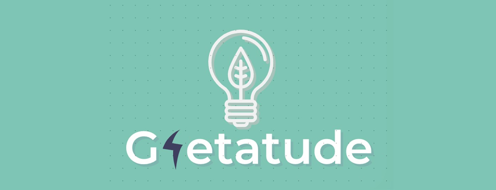

# Gretatude ⚡

<!-- Banner -->

  

 ## 📌 Introduction
 
a google chrome extension is one of our major solutions for better encouragement of energy conservation. 

## 📣  Additional Info

The solving of the  acute energy sho
rtage faced by people, due to lack of tools,analysis and foresight, with the help of modern day computation technology, alongside lessening the economic burden caused as a result of the same.
To achieve the above, one must strive to create awareness amongst the people and inculcate the values that will aid in becoming consumption wise independent. 
Let's see if Gretatude is up for the challenge!

## 📜 LICENSE
This project follows the MIT License.

